<!-- _class: lead -->
<!-- _paginate: false -->

# Benchmarking Open-Source LLMs on CV Question Answering Pipelines Using a Fixed Human-Annotated Dataset

## Fahim Morshed
### Master's Thesis Defense

Supervised by **Dr. Rahat Ibn Rafiq**

---

# Agenda

1. **Motivation & Problem Statement**
2. **Dataset Creation & Annotation**
3. **System Architecture & Pipeline Strategies**
4. **Experiment Design**
5. **Evaluation Framework**
6. **Results & Analysis** (RQ1–RQ4)
7. **Hardware Finding**
8. **Limitations & Future Work**
9. **Conclusion**

---

# Motivation

- Organizations process **hundreds to thousands** of CVs for hiring decisions
- Manual CV screening is **time-consuming, inconsistent, and subjective**
- Open-source LLMs are rapidly improving but **lack standardized benchmarks** for CV understanding tasks
- Existing NLP benchmarks (SQuAD, TriviaQA) don't capture the **structured + unstructured nature of CVs**
- No publicly available **human-annotated CV QA dataset** exists for systematic evaluation

> **Gap:** How well can open-source LLMs extract and reason over information in real-world CVs — and which pipeline strategy works best?

---

# Research Questions

1. **RQ1:** How do different retrieval strategies (full-context, keyword retrieval, semantic RAG) affect CV question-answering accuracy?

2. **RQ2:** How do open-source LLMs of varying sizes (1.5B, 7B, 13B parameters) compare on CV QA tasks in terms of accuracy, reasoning quality, and efficiency?

3. **RQ3:** What types of questions and error patterns emerge across different pipeline configurations?

4. **RQ4:** How well do model-generated confidence scores and rationales correlate with actual answer correctness?

---

# Background: LLMs for Information Extraction

- **Large Language Models** have shown strong capabilities in reading comprehension and information extraction
- Open-source models (Mistral, LLaMA, Qwen) now approach proprietary model quality for many tasks
- Key challenge: **context window management** — CVs vary in length and structure
- Two paradigms:
  - **Full-context:** Feed entire document to the model
  - **Retrieval-Augmented Generation (RAG):** Retrieve relevant sections first, then generate

---

# Background: CV as a Document Type

- CVs are **semi-structured documents** — mix of free text, tables, lists, and formatting
- Information is distributed across sections: education, experience, skills, publications
- Questions fall into two types:
  - **Entity/Numeric:** "What is the applicant's GPA?" (precise extraction)
  - **Descriptive:** "Describe the applicant's research experience" (reasoning + synthesis)
- PDF extraction introduces **noise** — lost formatting, merged columns, OCR artifacts

---

# Related Work

| Area | Key Work | Gap |
|------|----------|-----|
| Reading Comprehension | SQuAD, TriviaQA, Natural Questions | Not domain-specific to CVs |
| Document QA | DocVQA, InfographicsVQA | Focus on visual layout, not text extraction |
| Resume Parsing | Rule-based NER, Resume-NER datasets | Named entity extraction only, no QA |
| RAG Systems | Lewis et al. (2020), REALM | General-purpose, not evaluated on CV domain |
| LLM Benchmarks | MMLU, HellaSwag, HumanEval | Test general knowledge, not document understanding |

**Our contribution:** A structured, human-annotated benchmark specifically designed for evaluating CV question-answering pipelines.

---

# Dataset Creation Pipeline

---

# Dataset Creation: CV Collection

- **Sources:**
  - Publicly available CVs from personal websites
  - Voluntarily shared by peers, classmates, and colleagues
- **100 CVs** collected in total
- Diverse backgrounds: academia, industry, varying experience levels
- All CVs in **PDF format** — real-world documents, not synthetic
- No standardized template — reflects real-world variability

---

# Dataset Creation: Question Design

**30 questions** spanning 6 categories:

| Category | Example Questions |
|----------|------------------|
| **Personal Information** | Full name, contact details |
| **Education** | Institutions attended, GPA, degrees |
| **Professional Experience** | Current employer, years of experience |
| **Skills** | Programming languages, technical skills |
| **Research & Publications** | Publication count, research areas |
| **Awards & Extracurricular** | Awards, certifications |

**Answer Types:** Entity/Numeric and Descriptive

---

# Dataset Creation: Annotation Process

1. **Initial Generation:** Each CV + 30 questions fed to ChatGPT UI
   - Output: structured JSON array of answers
   - Formatted into CSV using Python utility

2. **Human Verification & Correction:**
   - Every generated answer manually verified against the source CV
   - Corrections made where ChatGPT hallucinated or missed information

3. **Final Dataset:**
   - 100 CVs x 30 questions = **3,000 annotated QA pairs**
   - Experiment subset: **50 CVs x 30 questions = 1,500 records**

---

# System Architecture

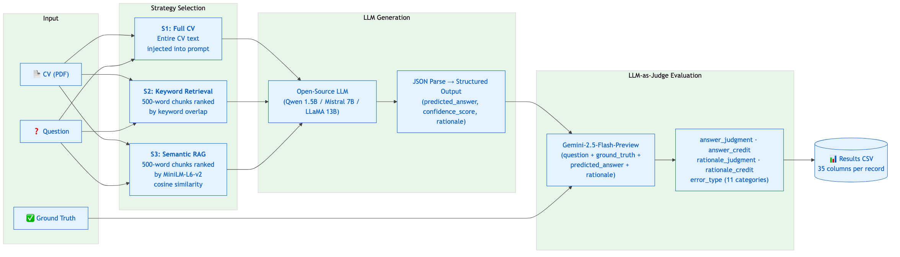

---

# Strategy 1: Full CV Context (S1)

- **Approach:** Entire CV text extracted via pypdf and injected into the prompt
- **Pros:** Maximum context — no information loss from retrieval
- **Cons:** Longer prompts, higher latency, may exceed context window for large CVs
- **Best for:** Questions requiring cross-section reasoning

The model sees everything in the CV — but has to find the relevant part itself.

---

# Strategy 2: Keyword-Based Retrieval (S2)

- **Approach:** CV chunked into **500-word segments**; ranked by **keyword overlap** with question
- **Pros:** Reduced prompt size, focused context
- **Cons:** Keyword matching may miss semantically relevant sections
- **Retrieval:** Lexical word overlap scoring

Smaller context window — but relies on surface-level word matching to find relevant sections.

---

# Strategy 3: Semantic RAG (S3)

- **Approach:** CV chunked into **500-word segments**; encoded with **all-MiniLM-L6-v2** embeddings
- **Retrieval:** Cosine similarity between question and chunk embeddings
- **Pros:** Captures meaning beyond keyword overlap
- **Cons:** Embedding quality dependency, additional compute
- **Caching:** Per-CV embedding cache for efficiency across questions

Semantic understanding for retrieval — but the embedding model is small and domain-general.

---

# Models Under Study

| Model | Parameters | Type | Key Characteristics |
|-------|-----------|------|---------------------|
| **Qwen2.5-1.5B-Instruct** | 1.5B | Instruct | Smallest, fastest, resource-efficient |
| **Mistral-7B-Instruct-v0.3** | 7B | Instruct | Mid-size, strong instruction following |
| **LLaMA-2-13B-Chat-HF** | 13B | Chat | Largest, most capable, highest resource cost |

- Represent a range of model sizes (1.5B, 7B, 13B)
- All open-source and locally deployable
- Cover different architecture families
- Enable analysis of **accuracy vs. efficiency tradeoffs**

---

# Experiment Design

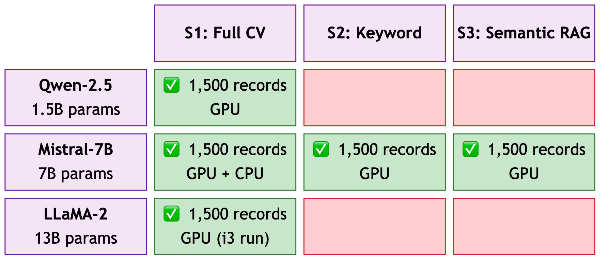

---

# Experiment Design: Configurations

### Strategy Comparison
*Fixed model: Mistral-7B*

| Run | Strategy | Records |
|-----|----------|---------|
| S1-Mistral | Full CV | 1,500 |
| S2-Mistral | Keyword | 1,500 |
| S3-Mistral | Semantic RAG | 1,500 |

### Model Comparison
*Fixed strategy: S1 Full CV*

| Run | Model | Records |
|-----|-------|---------|
| S1-Qwen | Qwen 1.5B | 1,500 |
| S1-Mistral | Mistral 7B | 1,500 |
| S1-LLaMA | LLaMA 13B | 1,500 |

**Total:** 5 unique configurations x 1,500 records = **7,500 evaluated QA pairs**

---

# Evaluation Framework

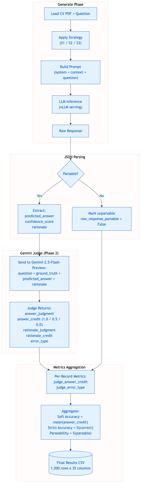

---

# Evaluation: LLM-as-Judge

**Judge Model:** Gemini-2.5-Flash-Preview (Google)

**Input:** question + ground_truth + predicted_answer + rationale

**Output per record:**

| Field | Values |
|-------|--------|
| **answer_judgment** | correct / partial / incorrect |
| **answer_credit** | 1.0 / 0.5 / 0.0 |
| **rationale_judgment** | correct / partial / incorrect |
| **rationale_credit** | 1.0 / 0.5 / 0.0 |
| **error_type** | 11 categories |

**Key Metrics:** Soft Accuracy = mean(answer_credit), Strict Accuracy = %(correct), Parseability = %(valid JSON)

---

# Evaluation: Error Taxonomy (11 Categories)

| Error Type | Description |
|------------|-------------|
| **None (Correct)** | No error — answer is correct |
| **Not Answered** | Model failed to provide an answer |
| **Missing Detail** | Correct direction but incomplete |
| **Contradiction** | Directly contradicts source |
| **Wrong Entity** | Extracted wrong entity from CV |
| **Wrong Numeric** | Incorrect numeric extraction |
| **Wrong Boolean** | Incorrect yes/no answer |
| **Invented Value** | Hallucinated for N/A questions |
| **Extra Detail** | Added information not in CV |
| **Format Issue** | Correct but formatted unusably |
| **Other** | Uncategorized errors |

---

<!-- _class: lead -->

# Results & Analysis

---

# Master Results Table

| Configuration | Soft Acc. | Strict Acc. | Parseability | Avg Latency | Med. Latency | Avg In Tokens | Avg Out Tokens |
|---------------|-----------|-------------|--------------|-------------|--------------|---------------|----------------|
| **S1 Qwen-2.5 (1.5B)** | 0.531 | 0.315 | 0.869 | 2.01s | 2.02s | 2,130 | 125 |
| **S1 Mistral (GPU)** | **0.579** | **0.358** | 0.789 | 2.12s | 1.95s | 2,525 | 86 |
| **S1 LLaMA-2 (13B)** | 0.551 | 0.315 | 0.816 | 5.44s | 4.23s | 2,593 | 119 |
| **S2 Mistral-7B** | 0.483 | 0.323 | 0.847 | 1.75s | 1.43s | 1,170 | 75 |
| **S3 Mistral-7B** | 0.403 | 0.274 | **0.881** | 1.94s | 1.69s | 990 | 72 |

> **Key finding:** Mistral-7B with full CV context (S1) achieves the highest accuracy. Retrieval strategies (S2, S3) reduce latency but sacrifice accuracy. Bigger models (LLaMA 13B) don't outperform Mistral 7B.

---

<!-- _class: lead -->

# RQ1: How Do Retrieval Strategies Affect Accuracy?
*S1 vs S2 vs S3 — Model fixed to Mistral-7B*

---

# RQ1: Overall Accuracy by Strategy

---

# RQ1: Per-Category Accuracy by Strategy

---

# RQ1: Error Distribution by Strategy

---

# RQ1: Efficiency Comparison

---

# RQ1: Key Findings

- **S1 (Full CV) wins on accuracy:** 0.579 soft accuracy vs 0.483 (S2) and 0.403 (S3)
- **S2 and S3 suffer from "not_answered" errors:** Retrieval misses relevant sections, causing the model to decline answering
  - S2: 354 not_answered | S3: 480 not_answered | S1: only 21
- **S3 (Semantic RAG) underperforms S2 (Keyword):** The small MiniLM-L6-v2 embedding model may not capture CV-domain semantics effectively
- **Retrieval saves tokens:** S2 uses ~1,170 input tokens vs S1's ~2,525 — a **54% reduction**
- **Trade-off:** Full context is worth the extra cost for CV QA accuracy

---

<!-- _class: lead -->

# RQ2: How Do Models of Varying Sizes Compare?
*Qwen 1.5B vs Mistral 7B vs LLaMA 13B — Strategy fixed to S1*

---

# RQ2: Overall Accuracy by Model

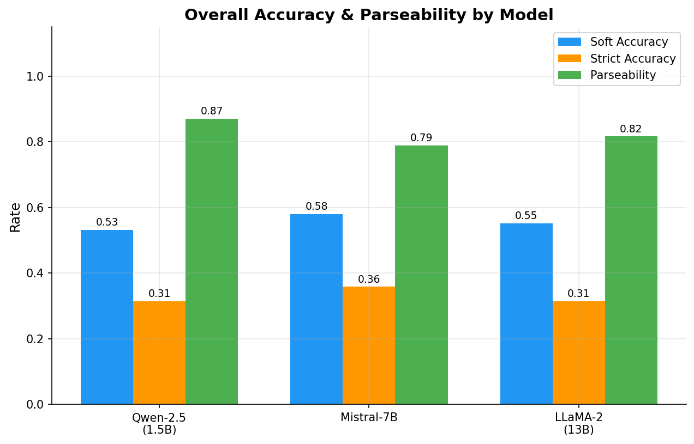

---

# RQ2: Accuracy vs Model Size

---

# RQ2: Per-Category Accuracy by Model

---

# RQ2: Error Distribution by Model

---

# RQ2: Latency Distribution

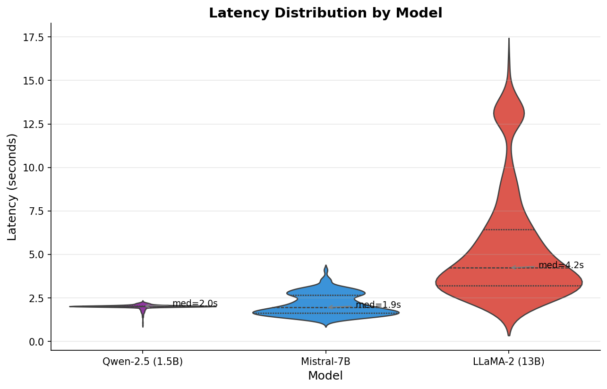

---

# RQ2: Accuracy vs Latency Tradeoff

---

# RQ2: Key Findings

- **Bigger is NOT always better:** LLaMA-13B (0.551) does not outperform Mistral-7B (0.579) despite being nearly 2x the size
- **LLaMA-13B hit GPU memory limits** (99% utilization) — memory pressure likely caused degraded outputs
- **Qwen-1.5B is competitive:** 0.531 soft accuracy at 1/5th the size of Mistral, with comparable latency
- **Mistral-7B is the sweet spot:** Best accuracy, moderate latency (2.12s avg), balanced resource usage
- **Latency scales with size:** LLaMA averages 5.44s vs Mistral's 2.12s — a **2.6x slowdown**
- **Parseability varies:** Qwen (86.9%) > LLaMA (81.6%) > Mistral (78.9%)

---

<!-- _class: lead -->

# RQ3: What Question Types and Error Patterns Emerge?
*Cross-cutting analysis across all configurations*

---

# RQ3: Error Heatmap (Error Type x Config)

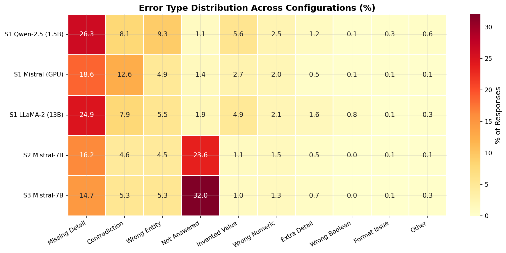

---

# RQ3: Accuracy by Answer Type x Strategy

---

# RQ3: Accuracy by Answer Type x Model

---

# RQ3: Category Radar Chart

---

# RQ3: Top Errors Overall

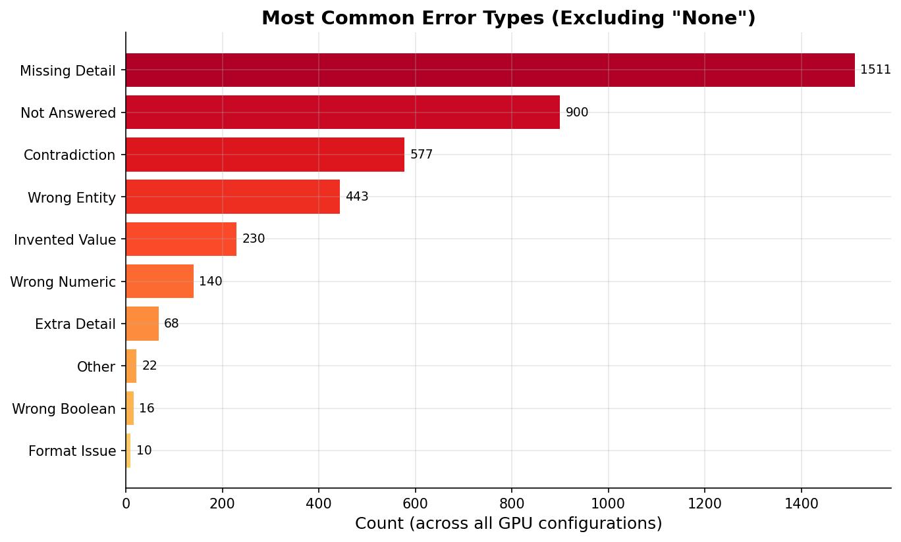

---

# RQ3: Per-CV Accuracy Spread

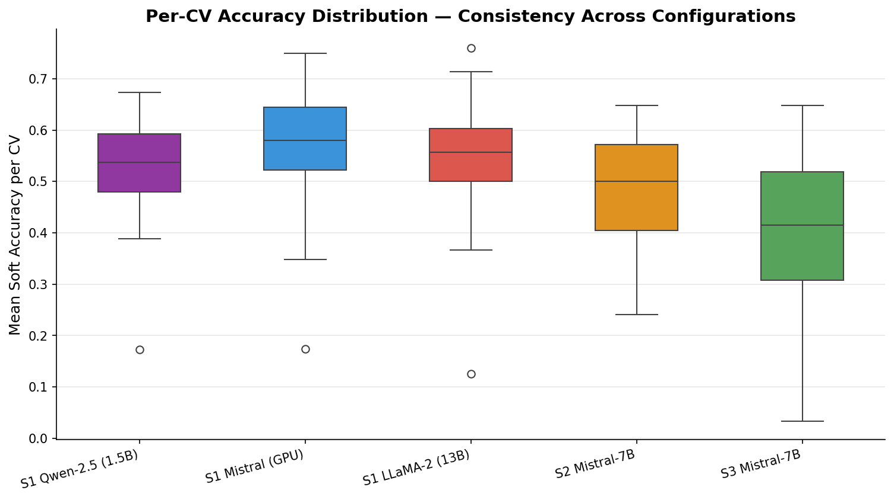

---

# RQ3: Key Findings

- **"Missing Detail" is the dominant error** (1,511 total) — models often give partially correct answers
- **"Not Answered" spikes in retrieval strategies** — S2: 354, S3: 480 vs S1: 16–29
- **Entity/Numeric questions** are easier than Descriptive across all configs
- **Education** is the easiest category; **Awards & Extracurricular** is the hardest
- **Per-CV accuracy varies widely** — some CVs are consistently harder across all models (likely due to PDF extraction quality or unusual formatting)

---

# RQ3: Per-Category Accuracy Table

| Category | S1 Qwen | S1 Mistral | S1 LLaMA | S2 Mistral | S3 Mistral |
|----------|---------|------------|----------|------------|------------|
| Personal Info | 0.581 | 0.635 | 0.555 | 0.594 | 0.538 |
| Education | 0.712 | **0.769** | 0.577 | 0.697 | 0.536 |
| Prof. Experience | 0.469 | 0.530 | 0.503 | 0.423 | 0.327 |
| Skills | 0.500 | 0.451 | **0.597** | 0.304 | 0.256 |
| Research & Projects | 0.489 | 0.596 | 0.551 | 0.498 | 0.407 |
| Awards & Extra. | 0.434 | 0.355 | **0.602** | 0.243 | 0.279 |

> LLaMA-13B surprisingly leads on Skills and Awards categories — where its larger capacity helps with less structured content.

---

<!-- _class: lead -->

# RQ4: Confidence Scores & Rationale Quality
*Cross-cutting analysis across all configurations*

---

# RQ4: Calibration Plot

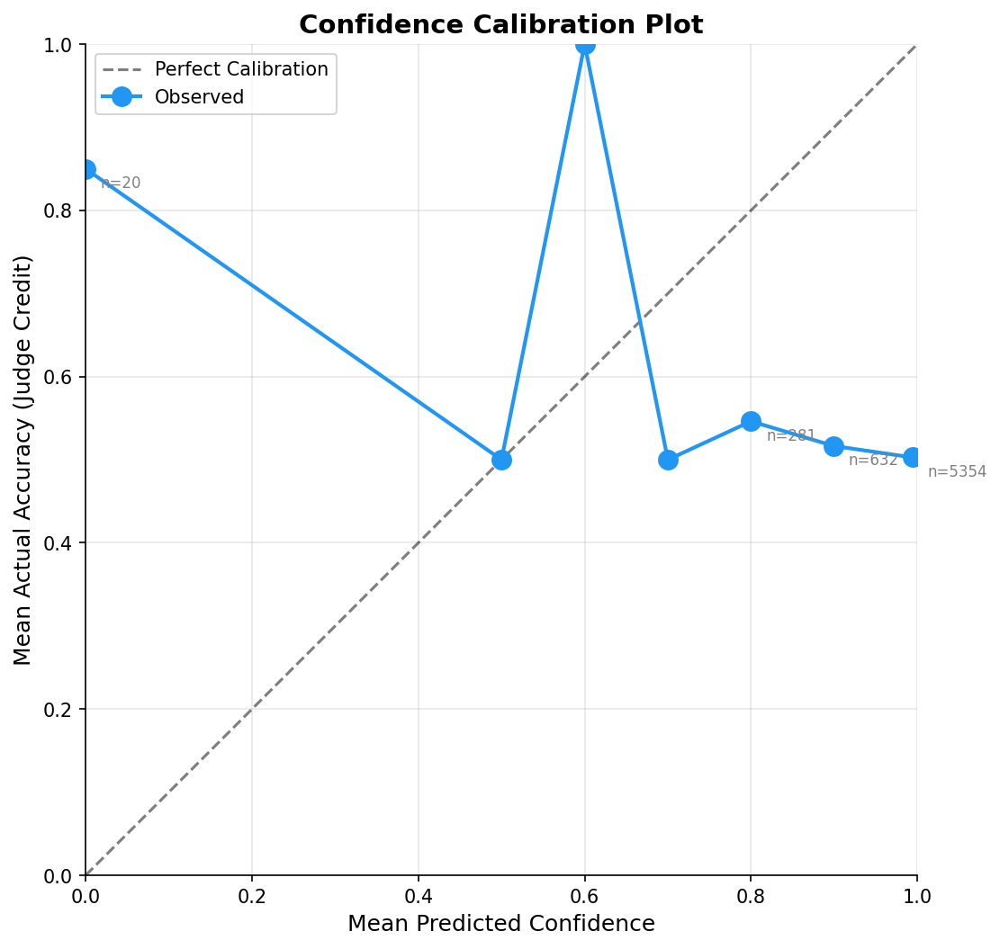

---

# RQ4: Confidence Score Distribution

---

# RQ4: Confidence by Judgment

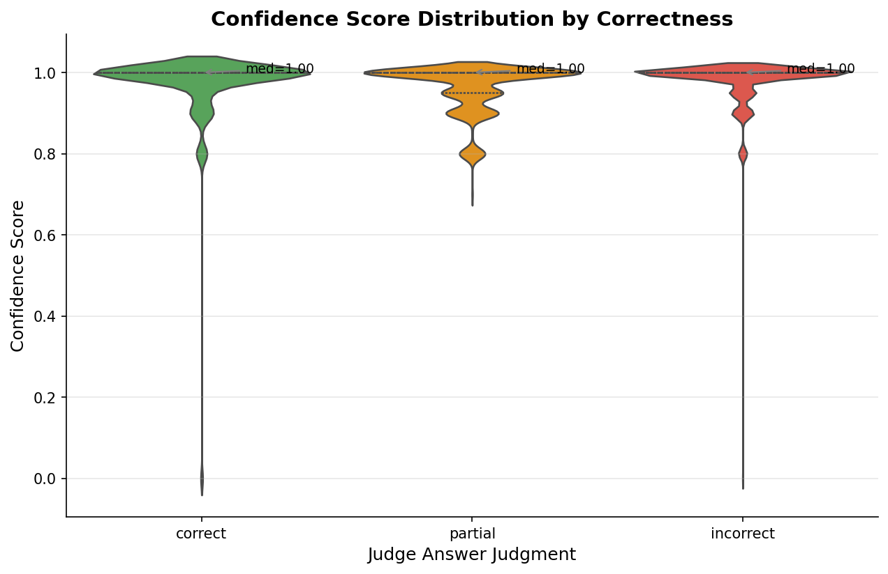

---

# RQ4: Rationale Quality

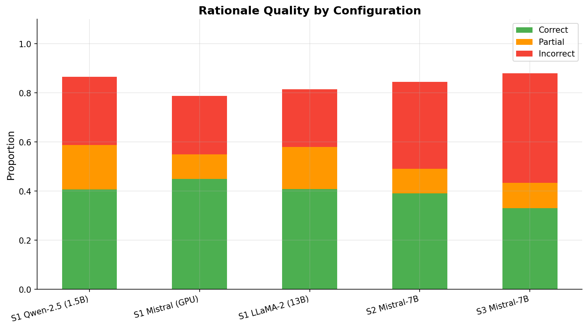

---

# RQ4: Answer vs Rationale Judgment

---

# RQ4: Key Findings

- **Models are overconfident:** Confidence scores cluster at 0.8–1.0 regardless of correctness
- **Poor calibration:** High confidence does NOT reliably indicate correct answers
- **Confidence is not a useful filter** for production use — cannot use it to flag uncertain answers
- **Rationale quality tracks answer quality:** Correct answers mostly have correct rationales
- **Right answer, wrong reason exists:** Some models get answers right through pattern matching rather than genuine understanding

---

<!-- _class: lead -->

# Separate Finding: Hardware Impact
*GPU vs CPU — Mistral-7B, Strategy S1*

---

# Hardware: Latency Comparison

---

# Hardware: Accuracy Comparison

---

# Hardware: Key Findings

- **GPU is ~55x faster** than CPU for Mistral-7B inference
- **Accuracy is comparable** between GPU and CPU runs — the model produces similar quality outputs regardless of hardware
- **CPU is viable** for small-scale or offline processing where latency is acceptable
- **Implication:** Hardware choice affects throughput, not answer quality

---

# Error Taxonomy: Full Counts

| Error Type | S1 Qwen | S1 Mistral | S1 LLaMA | S2 Mistral | S3 Mistral | **Total** |
|------------|---------|------------|----------|------------|------------|-----------|
| None (Correct) | 472 | 537 | 472 | 484 | 411 | **2,376** |
| Missing Detail | 395 | 279 | 373 | 243 | 221 | **1,511** |
| Not Answered | 16 | 21 | 29 | 354 | 480 | **900** |
| Contradiction | 121 | 189 | 119 | 69 | 79 | **577** |
| Wrong Entity | 140 | 74 | 82 | 68 | 79 | **443** |
| Invented Value | 84 | 40 | 74 | 17 | 15 | **230** |
| Wrong Numeric | 37 | 30 | 32 | 22 | 19 | **140** |
| Extra Detail | 18 | 7 | 24 | 8 | 11 | **68** |
| Other | 9 | 2 | 5 | 2 | 4 | **22** |
| Wrong Boolean | 2 | 2 | 12 | 0 | 0 | **16** |
| Format Issue | 5 | 2 | 1 | 1 | 1 | **10** |

---

# Discussion: Key Takeaways

1. **Full CV context (S1) is best for accuracy** — retrieval strategies lose too much information for CV QA
2. **Mistral-7B is the sweet spot** — best accuracy at reasonable compute cost; bigger (LLaMA 13B) doesn't help
3. **"Missing Detail" dominates errors** — models partially answer rather than completely failing
4. **Retrieval strategies cause "Not Answered" spikes** — chunk selection misses relevant CV sections
5. **Confidence scores are unreliable** — models report high confidence even when wrong
6. **Hardware affects speed, not quality** — GPU gives ~55x speedup with equivalent accuracy
7. **Education questions are easiest; Awards & Extracurricular are hardest** — structured content is easier to extract

---

# Limitations

- **Hardware constraints:** LLaMA-13B pushed GPU to 99% utilization — results may improve on better hardware
- **Dataset scope:** 50 CVs in experiments — limited diversity in domains and formats
- **Model selection:** Three models from a rapidly evolving landscape
- **PDF extraction:** pypdf-based extraction loses formatting that visual models could leverage
- **Single-language:** English-only CVs and questions
- **Judge reliability:** Gemini-based evaluation may have biases (mitigated by spot-checking)
- **No fine-tuning:** All models used in zero-shot setting
- **Retrieval chunking:** Fixed 500-word chunks may not align with CV section boundaries

---

# Future Work

- **Expand dataset:** More CVs, more question types, multi-language support
- **Visual document understanding:** Layout-aware models (e.g., LayoutLM) that use formatting cues
- **Fine-tuning experiments:** Domain-specific fine-tuning on CV QA task
- **Newer models:** Evaluate emerging models (Mistral v0.4+, LLaMA 3, Qwen 2.5+, Phi-3)
- **Hybrid retrieval strategies:** Combine keyword and semantic retrieval
- **Adaptive chunking:** Section-aware chunking instead of fixed 500-word windows
- **Human evaluation study:** Systematic inter-annotator agreement on judge quality
- **Production deployment:** Integrate findings into real-world decision support systems

---

# Conclusion

- **Created** a novel human-annotated benchmark of **3,000 CV QA pairs** (100 CVs x 30 questions)
- **Designed** a modular evaluation framework with **3 pipeline strategies** and **3 model sizes**
- **Evaluated** 7,500 records using **Gemini-2.5-Flash as LLM judge** across 5 configurations
- **Found** full CV context + Mistral-7B as the optimal configuration (0.579 soft accuracy)
- **Identified** systematic error patterns, with "missing detail" as the dominant failure mode
- **Demonstrated** that confidence scores are poorly calibrated across all models
- **Showed** hardware choice affects throughput (~55x) but not answer quality

> This work provides a systematic foundation for evaluating and selecting LLM-based pipelines for CV information extraction tasks.

---

<!-- _class: lead -->
<!-- _paginate: false -->

# Thank You

## Questions?

**Fahim Morshed**
Supervised by **Dr. Rahat Ibn Rafiq**
